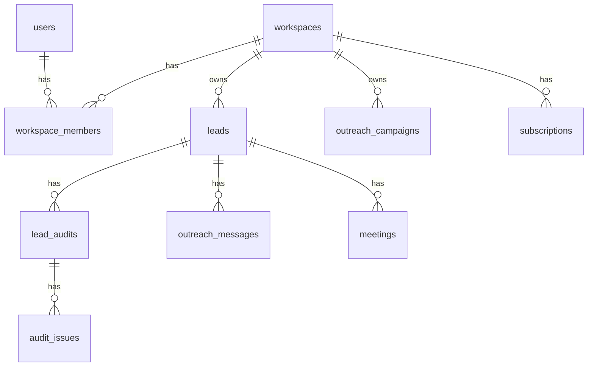

# NexLead ERD (Planned)

**Purpose:** High-level entity relationship model for the NexLead data layer.

- `users` belong to one or more `workspaces` through `workspace_members`.
- `workspaces` own `leads`, `outreach_campaigns`, `pipeline_stages`, and `subscriptions`.
- Each `lead` can have many `lead_audits`, `outreach_messages`, and `meetings`.
- `lead_audits` contain many `audit_issues`.
- `outreach_messages` may optionally link to `outreach_campaigns`.

